<div align="center">



</div>

---

<div align="center">

<!-- Tech Badges -->


</div>

---

## 🧠 About Me

```bash
$ whoami
> Tawfik Hegazy — CS Student @ Egyptian Chinese University (ECU), Cairo 🇪🇬
> 2nd-Year Computer Science | Full-Stack Developer | Embedded Systems Engineer
> Freelancer on Fiverr | UAV Builder | Hackathon Competitor
```

- 🚀 Built a **MQ-9 Reaper-inspired UAV drone** that achieved a **flawless first flight** on its debut test
- 🏎️ Secured **2nd Place** in the Formula One Engineering Competition
- 🌍 Competed in the **NASA Space Apps Hackathon** — led frontend UX/UI
- 💼 Completed a **90-hour NTI-certified Web Development Internship**
- 🛰️ Active member of **space f(x) / f(x) Robotics** technical team
- 📡 Currently mastering **Computer Networks** (Kurose & Ross) + CompTIA **Network+/Security+**

---

## 📊 At a Glance

<div align="center">



</div>

---

## 🛠️ Technical Skills

<div align="center">



</div>

---

## 🚀 Featured Projects

### ✈️ MQ-9 Reaper-Inspired UAV Drone
> **Domain:** Aerospace Engineering · Embedded Systems · Robotics  
> **Team:** space f(x) / f(x) Robotics

- Collaborative hardware design, component assembly, and flight telemetry execution
- Achieved a **flawless first flight** on its very first test attempt
- Microcontrollers: **Arduino + ESP32** for wireless networking and sensor integration


---

### 🛒 BigBoyZ RC — E-Commerce Platform & Dashboard
> **Stack:** MongoDB · Express.js · Angular · Node.js (MEAN)

- Custom **administrative dashboard** for inventory and product management
- Product specification **catalog management** system
- **Secure encrypted authentication** and login modules


---

### 🗿 Giza Pyramids & Museum — 3D Interactive Simulation
> **Stack:** C++ · OpenGL · FreeGLUT

- Structurally accurate **real-time 3D interactive simulation** of the Giza plateau
- Low-level rendering: **camera matrix optimization**, lighting engine, vertex pipeline
- Pure OpenGL — no game engines, no shortcuts


---

### 🚀 NASA Hackathon — "Is It The Lunch Day?"
> **Type:** Interactive weather forecasting web app · NASA Space Apps Challenge

- **Led the entire frontend UX and UI** code implementation
- Real-time meteorological data pulling and weather forecast modeling
- Dynamic telemetry layout with live data visualization


---

### 🏎️ Formula One Engineering Competition
> **Domain:** Automotive Hardware Systems · Robotics

- Co-engineered and physically optimized an **F1 racing chassis and mechanics**
- Competed against top university engineering teams in Egypt
- **🥈 Secured 2nd Place overall**


---

### 🎓 Educational Center Platform
> **Stack:** MongoDB · Express.js · Angular · Node.js (MEAN)

- Commercial **e-learning web platform** with course storefront and sales module
- Complete **user identity management** system
- Secure **authentication routing gates** with JWT


---

### 💼 NTI Web Development Internship Project
> **Stack:** MEAN Stack · **Certified by National Telecommunication Institute (NTI)**

- Built during a rigorous **90-hour professional internship**
- Advanced **RESTful API routing** and **NoSQL schema persistence**
- Responsive frontend component design and architecture


---

## 🔧 Hardware & CAD Engineering

| Domain | Tools & Skills |
|---|---|
| **Microcontrollers** | Arduino, ESP32 — wireless networking, sensor integration, firmware |
| **3D Modeling** | Autodesk Fusion 360 — sumo robot chassis, component shields, structural design |
| **Aerospace** | UAV assembly, flight telemetry, component testing |
| **Motorsport** | F1-class chassis engineering, mechanical optimization |

---

## 📡 Networking & Infrastructure

```
CompTIA Network+ aligned  ▓▓▓▓▓▓▓▓▓▓▓▓▓▓▓░░  78%
CompTIA Security+ aligned ▓▓▓▓▓▓▓▓▓▓▓▓▓▓░░░  75%

Topics: Advanced Subnetting · Packet Routing Analysis
        Traffic Mitigation · Cryptographic Baselines
        OSI Model Deep Dive (Kurose & Ross)
```

---

## 📚 Currently Learning

- 🌐 **Computer Networks** — deep-diving OSI layers, TCP/IP, DHCP, routing protocols
- 🔐 **CompTIA Security+** — cryptography, network defense, threat modeling
- ⚡ **Advanced ESP32** — real-time wireless sensor meshes

---

## 📫 Connect

<div align="center">

[](https://www.fiverr.com/tawfik_hegazy)
[](https://ecu.edu.eg)
[](https://maps.google.com/?q=Cairo,Egypt)

</div>

---

<div align="center">

*"Build it. Test it. Fly it."* — space f(x) Robotics team motto


</div>
